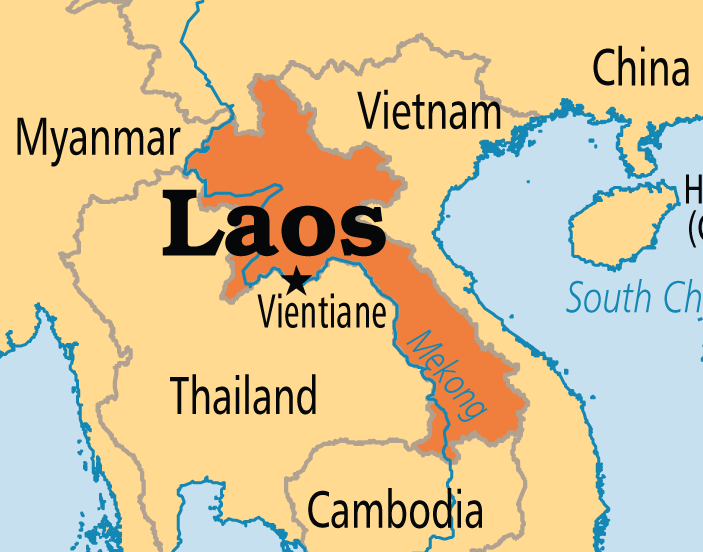
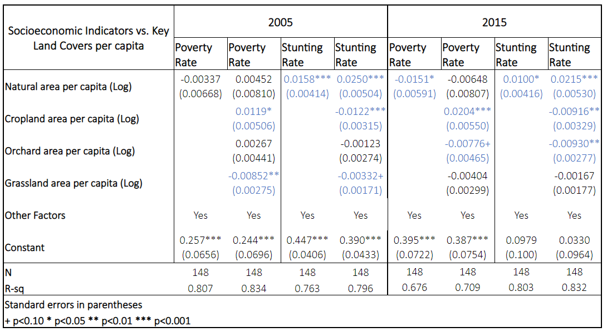

background-image: url(Pictures/Motivation.jpg)
background-size: cover

class: inverse, center, middle

# Motivation

```{r setup, include=FALSE}
knitr::opts_chunk$set(echo = FALSE)

library(plotly)
library(readxl)
library(PerformanceAnalytics)

LaoSDG_ALL_LC <- read_excel("~/SDG Paper/Graphs/IndicatorPSN_0621.xlsx")

LaoSDG_ALL_LC$Natpop<-LaoSDG_ALL_LC$Natpop15-LaoSDG_ALL_LC$Natpop05
LaoSDG_ALL_LC$LNatpop<-LaoSDG_ALL_LC$LNatpop15-LaoSDG_ALL_LC$LNatpop05

LaoSDG_ALL_LC$Croppop<-LaoSDG_ALL_LC$Croppop15-LaoSDG_ALL_LC$Croppop05
LaoSDG_ALL_LC$LCroppop<-LaoSDG_ALL_LC$LCroppop15-LaoSDG_ALL_LC$LCroppop05

LaoSDG_ALL_LC$Prov<-round(LaoSDG_ALL_LC$Dcode/100)
LaoSDG_ALL_LC$tot_pop<-LaoSDG_ALL_LC$tot_pop15-LaoSDG_ALL_LC$tot_pop05
LaoSDG_ALL_LC$tot_popgr<-(LaoSDG_ALL_LC$tot_pop15-LaoSDG_ALL_LC$tot_pop05)/LaoSDG_ALL_LC$tot_pop05
LaoSDG_ALL_LC$RelPopGr<-LaoSDG_ALL_LC$tot_popgr/.15
LaoSDG_ALL_LC$Agric05<-LaoSDG_ALL_LC$cropland05+LaoSDG_ALL_LC$orchard05 +LaoSDG_ALL_LC$grasslands05
LaoSDG_ALL_LC$Agric15<-LaoSDG_ALL_LC$cropland15+LaoSDG_ALL_LC$orchard15 +LaoSDG_ALL_LC$grasslands15
LaoSDG_ALL_LC$Agric<-LaoSDG_ALL_LC$Agric15-LaoSDG_ALL_LC$Agric05
LaoSDG_ALL_LC$AgricPop05<-LaoSDG_ALL_LC$Agric05/LaoSDG_ALL_LC$tot_pop05
LaoSDG_ALL_LC$AgricPop15<-LaoSDG_ALL_LC$Agric15/LaoSDG_ALL_LC$tot_pop15
LaoSDG_ALL_LC$AgricPop<-LaoSDG_ALL_LC$AgricPop15-LaoSDG_ALL_LC$AgricPop05

Status05_PSN<-plot_ly(LaoSDG_ALL_LC, x = ~Pov05, y = ~Stunt05, z = ~LNatpop05, type = "scatter3d", mode = "markers", color=~factor(Province), size= ~tot_pop05, marker = list(symbol = 'circle', sizemode = 'diameter'), sizes = c(5, 50))
Status05_PSN<-Status05_PSN  %>% layout(scene = list(xaxis = list(title = 'Poverty Rate'),
                      yaxis = list(title = 'Stunting Rate'),
                      zaxis = list(title = 'Natural Area p.c  (Log)')))

Status15_PSN<-plot_ly(LaoSDG_ALL_LC, x = ~Pov15, y = ~Stunt15, z = ~LNatpop15, type = "scatter3d", mode = "markers", color=~factor(Province), size= ~tot_pop15, marker = list(symbol = 'circle', sizemode = 'diameter'), sizes = c(5, 50))
Status15_PSN<-Status15_PSN  %>% layout(scene = list(xaxis = list(title = 'Poverty Rate'),
                      yaxis = list(title = 'Stunting Rate'),
                      zaxis = list(title = 'Natural Area p.c  (Log)')))

Change_PSN<-plot_ly(LaoSDG_ALL_LC, x = ~PovChange, y = ~StuntChange, z = ~(-NatChange), type = "scatter3d", mode = "markers", color=~factor(Province), 
        size= ~tot_pop15, marker = list(symbol = 'circle', sizemode = 'diameter'), sizes = c(5, 50))
Change_PSN<-Change_PSN  %>% layout(scene = list(xaxis = list(title = 'Poverty Change'),
                      yaxis = list(title = 'Stunting Change'),
                      zaxis = list(title = 'Natural Degradation')))

Change_PSC<-plot_ly(LaoSDG_ALL_LC, x = ~PovChange, y = ~StuntChange, z = ~cropland, type = "scatter3d", mode = "markers", color=~factor(Province), 
        size= ~tot_pop15, marker = list(symbol = 'circle', sizemode = 'diameter'), sizes = c(5, 50))
Change_PSC<-Change_PSC  %>% layout(scene = list(xaxis = list(title = 'Poverty Change'),
                      yaxis = list(title = 'Stunting Change'),
                      zaxis = list(title = 'Cropland Area Change')))

Change_PSN2<-plot_ly(LaoSDG_ALL_LC, x = ~PovChange, y = ~StuntChange, z = ~(-Natpop), type = "scatter3d", mode = "markers", color=~factor(Province), 
        size= ~RelPopGr, marker = list(symbol = 'circle', sizemode = 'diameter'), sizes = c(5, 50))
Change_PSN2<-Change_PSN2  %>% layout(scene = list(xaxis = list(title = 'Poverty Change'),
                      yaxis = list(title = 'Stunting Change'),
                      zaxis = list(title = 'Natural Degradation p.c ')))

Change_PSC2<-plot_ly(LaoSDG_ALL_LC, x = ~PovChange, y = ~StuntChange, z = ~Croppop, type = "scatter3d", mode = "markers", color=~factor(Province), 
        size= ~RelPopGr, marker = list(symbol = 'circle', sizemode = 'diameter'), sizes = c(5, 50))
Change_PSC2<-Change_PSC2  %>% layout(scene = list(xaxis = list(title = 'Poverty Change'),
                      yaxis = list(title = 'Stunting Change'),
                      zaxis = list(title = 'Cropland Area p.c Change')))

Change_PSA<-plot_ly(LaoSDG_ALL_LC, x = ~PovChange, y = ~StuntChange, z = ~Agric, color=~factor(Province),
        size= ~RelPopGr, marker = list(symbol = 'circle', sizemode = 'diameter'), sizes = c(5, 50))
Change_PSA<-Change_PSA  %>% layout(scene = list(xaxis = list(title = 'Poverty Change'),
                      yaxis = list(title = 'Stunting Change'),
                      zaxis = list(title = 'Agricultural Area Change')))

Change_PSA2<-plot_ly(LaoSDG_ALL_LC, x = ~PovChange, y = ~StuntChange, z = ~AgricPop, color=~factor(Province),
        size= ~RelPopGr, marker = list(symbol = 'circle', sizemode = 'diameter'), sizes = c(5, 50))
Change_PSA2<-Change_PSA2  %>% layout(scene = list(xaxis = list(title = 'Poverty Change'),
                      yaxis = list(title = 'Stunting Change'),
                      zaxis = list(title = 'Agricultural Area p.c. Change')))

fitP_S05<-lm(Stunt05~Pov05, LaoSDG_ALL_LC)
fitP_LN05<-lm(LNatpop05~Pov05, LaoSDG_ALL_LC)
fitS_LN05<-lm(LNatpop05~Stunt05, LaoSDG_ALL_LC)

fitP_S15<-lm(Stunt15~Pov15, LaoSDG_ALL_LC)
fitP_LN15<-lm(LNatpop15~Pov15, LaoSDG_ALL_LC)
fitS_LN15<-lm(LNatpop15~Stunt15, LaoSDG_ALL_LC)

fitP_S<-lm(StuntChange~PovChange, LaoSDG_ALL_LC[(LaoSDG_ALL_LC$`PovChange 1T 10%`==1 & LaoSDG_ALL_LC$`StuntChangeSE 1T 10%`==1),])
fitP_LN<-lm(-LNatpop~PovChange, LaoSDG_ALL_LC[(LaoSDG_ALL_LC$`PovChange 1T 10%`==1),])
fitS_LN<-lm(-LNatpop~StuntChange, LaoSDG_ALL_LC[(LaoSDG_ALL_LC$`StuntChangeSE 1T 10%`==1),])

```

---
# Sustainable Development and Food Security

.pull-left[

- Sustainable Development Goals (SDGs): Public policy should endorse **economic development** as well as **social and environmental progress**.
  -  There are 17 goals and 169 targets
  -  SDG 2 aims to end hunger by 2030.

- Interactions betwee SDGs can occur. Example: `Agricultural policies`.
  - Higher income and food available
  - Higher deforestation

]
.pull-right[
```{r}

```

]
---
#Relevant Literature

**Trade-offs and Synergies**:

- Existence of interactions on specific goals/targets (Nilsson, 2017, Nerini, 2017, Weitz, 2018, Sherer, 2018, Bigerri 2019).

- Comparison between national indicators: 
  - Across all countries (Pradhan, 2017)
  - Countries in specific regions (Mainali, 2018)
  - Countries with similar income level (Lusseau, 2019)

- **Regarding our key SDGs**: Higher prioritization on economic and social development over environmental preservation, specially in Eastern and Southern Asian countries (Schmidt-Traub, 2017)

--

**Issue**: 

Lack of research on interactions at the subnational level. 

---
background-image: url(Pictures/Contribution.jpg)
background-size: cover
class: inverse, center, middle

# Contribution

---
# This paper

**Objectives**: 
- To estimate malnutrition rates at the district level in Lao PDR for 2005 and 2015.

- To compare the status and evolution of malnutrition rates to poverty rates and environmental degradation.

--

**Method**:

`Small Area Estimation`
  - Welfare indicators are usually measure through surveys, which are only representative at higher aggregated areas (regions/provinces)
  
  - Nutrition Mapping: 
    - Combining census and survey data we can estimate malnutrition rates at lower geographical levels. 

---
# Lao PDR

.pull-left[


]

.pull-right[

**Socio-economic Growth**
- Agriculture accounts for:
 - **65%** of national employment
 - **67%** of rural income.

- National Socioeconomic Development Plans (NSDP) encouraged a **shift from subsistence to commercial agriculture**:
  - Poverty headcount: from **39.1%** (1997) to **18.3%** (2018).
  - Global Hunger Index (GHI): from **52.2%** (1997) to **25.3%** (2018).
]

---
# Lao PDR

.pull-left[


]

.pull-right[
**Environmental Impact**
- According to the Global Forest Watch, **63% of tree cover loss** since 2000 was due to:
  - Shifting agriculture and forestry
  - Commercial agricultural expansion.
]

---
# Main Findings

**General**
- High reduction of poverty and stunting in most districts, but it is highly heterogeneous.

- Natural degradation is highly concentrated in some districts.

--

.pull-left[
**Status 2005 and 2015**
- Higher poverty and malnutrition rates found in districts with higher natural areas.

- Agricultural areas mainly responsible for natural degradation.

- **Larger cropland p.c.** associated to **lower malnutrition rates**, but **higher poverty rates**.

]

--

.pull-right[
**Evolution from 2005 to 2015**
- Changes are **not correlated** at the district level.

- Increase in cropland associated to average poverty and stunting reduction.

- Higher reduction of poverty and malnutrition is **focus on the Southern region**, where there are heterogeneous effects in the environment.
]

---
background-image: url(Pictures/SmallArea.jpg)
background-size: cover
class: inverse, center, middle

# Small Area Estimation
---
# Elbers, Lanjouw and Lanjouw method (2003)
.pull-left[
**Goal**: Estimation of poverty and inequality indicators at small areas in developing countries.

- Adopted by World Bank as the main method for the development of **Poverty Maps** (Povmap software)

]
.pull-right[


.right[(World Bank, 2007)]
]
---
# Example: Poverty Rates Laos 2015

.pull-left[

]

--

.pull-right[

]

Source: Center of Development and Environment

---
# Methodology
.pull-left[

]
.pull-right[
- **First Step**: Feasible GLS Estimation
$$y_{ch}^s=x_{ch}^s \hat{\beta} + u_{ch} \qquad u \sim (0,\hat{\Sigma})$$

$$u_{ch}= \eta_c+\mu_{ch}$$

- **Second Step**: Monte Carlo Simulation
$$\hat{y}_{ch}=x_{ch}^c \hat{\beta} + \hat{u}_{ch}$$

- **Third Step**: Aggregate using cut-off
$$P_{SA}=\frac{1}{N_{SA}}\sum_{i=1, i \in SA}^{N_{SA}} \mathbb{I}(\hat{y}<c)$$
]
---
name: NutMethod
# ELL Method for Nutrition Mapping

**Outcome variable**

Household consumption p.c. --> Z-scores for children younger than 5

--

**Measuring Malnutrition**

- `Wasting` (low weight-for-height): indicates acute malnutrition (short-term)

- `Stunting` (low height-for-age): indicates chronic malnutrition (long term)

- `Underweight` (low weight-for-age): indicates moderate
malnutrition 


--

**Z-scores**:

Standard deviations below the WHO International Child Growth Standards median.

--

**Improved method for nutrition**
- [Fujii (2010)](#Fujii): Incorporates the correlation among the anthropometric measures and two levels of clusterization.
---
# Main Data Sources
.pull-left[

Sources for **anthropometric information** and for which the statistical models were fitted.

- Lao PDR Multiple Indicator Cluster Survey (MICS) 2006

- Lao PDR Social Indicator Survey (LSIS) 2016

]
.pull-right[
Source used in the **prediction of malnutrition** indicators in small areas.

- Population and Housing Census 2005

- Population and Housing Census 2015
]
---
# Type of candidate variables

**Survey and Census information**

- Data on household's physical and economic status, individual
characteristics (child and relatives). They should match in
definition and distribution.

--

**Location averages from Census information**

- Information about ethnicity, religion, migration and occupation.

--

**GIS**

- Land covers, travel time to nearest city, nightlights, precipitation, etc. As well as, spatial limits of malaria transmission.

---
name: Procedure
# Procedure Model Selection

.pull-left[
1. Detect variables that present high correlation with z-score.

1. Use stepwise and elastic net regression, other variables were tested for significance and contribution to the model.
  - Including interactions and polynomials.
  
1. Test of multicollinearity and overfitting.
]

--

.pull-right[
.center[
`Stunting` and `Underweight` models were found. 
]
Unfortunately, a model for Wasting was not possible to be estimated due to its seasonality feature.

.right[
[Validation](#Val)
]
]
---
background-image: url(Pictures/Results.jpg)
background-size: cover
class: inverse, center, middle

# Results

---

# Stunting

.pull-left[
```{r}
 
```
]

.pull-right[
```{r}
 
```
]

---
# Poverty

.pull-left[
```{r}
 
```
]

.pull-right[
```{r}
 
```
]

---
# Natural Areas

.pull-left[
**Land Cover data by SERVIR MEKONG**

  - Regional Land Cover Monitoring System
    - Satellite data
    - On the ground validation
  
  - Areas considered to comprise the most biodiversity and green areas in the country:
    - Forest
    - Evergreen Broadleaf 
    - Mixed Forest
    - Wetlands
]

.pull-right[
```{r}
 
```
]


---
# Natural Areas

.pull-left[
```{r}
 
```
]

.pull-right[
```{r}
 
```
]
---
# Natural Change

From 2005 to 2015, only **5%** changed to another natural land cover:

```{r, out.width='75%', fig.align='center'}

```

---
# Status SDGs 2005

.pull-left[
**Main Finding**:

Higher poverty and stunting rates are located in districts with large natural areas per capita
]

.pull-right[
```{r,fig.height=4, dev='svg'}
ggplot(LaoSDG_ALL_LC, aes(x=Pov05, y=Stunt05))+ 
  geom_point(colour="#DF536B",size=2)+
  geom_smooth(method='lm', formula= y~x, se=TRUE)+
  xlab("Poverty Rate") + ylab("Stunting Rate")+
  theme(axis.title.x = element_text(size=20),
axis.title.y = element_text(size=20))+
  labs(title = paste(" Slope =",signif(fitP_S05$coef[[2]], 4),
                     " P value =" , signif(summary(fitP_S05)$coef[2,4], 4)))
```
]

.pull-left[
```{r,fig.height=4, dev='svg'}
ggplot(LaoSDG_ALL_LC, aes(x=Stunt05, y=LNatpop05))+
  geom_point(colour="#DF536B",size=2)+
  geom_smooth(method='lm', formula= y~x, se=TRUE)+
  xlab("Stunting Rate") + ylab("Natural Area p.c. (Log)")+
    theme(axis.title.x = element_text(size=20),
axis.title.y = element_text(size=20))+
  labs(title = paste(" Slope =",signif(fitS_LN05$coef[[2]], 4),
                     " P value =" , signif(summary(fitS_LN05)$coef[2,4], 4)))
```
]

.pull-right[
```{r,fig.height=4, dev='svg'}
ggplot(LaoSDG_ALL_LC, aes(x=Pov05, y=LNatpop05))+
  geom_point(colour="#DF536B",size=2)+
  geom_smooth(method='lm', formula= y~x, se=TRUE)+
  xlab("Poverty Rate") + ylab("Natural Area p.c. (Log)")+
    theme(axis.title.x = element_text(size=20),
axis.title.y = element_text(size=20))+
  labs(title = paste(" Slope =",signif(fitP_LN05$coef[[2]], 4),
                     " P value =" , signif(summary(fitP_LN05)$coef[2,4], 4)))
```
]
---
# Status SDGs 2005
```{r,echo=FALSE, message=FALSE, warning=FALSE, out.width="100%"}
Status05_PSN
```
---
# Status SDGs 2015

.pull-left[
**Main Finding**:

Higher poverty and stunting rates are located in districts with large natural areas per capita

- Some districts are being left behind
]

.pull-right[
```{r,fig.height=4, dev='svg'}
ggplot(LaoSDG_ALL_LC, aes(x=Pov15, y=Stunt15))+ 
  geom_point(colour="#DF536B",size=2)+
  geom_smooth(method='lm', formula= y~x, se=TRUE)+
  xlab("Poverty Rate") + ylab("Stunting Rate")+
  theme(axis.title.x = element_text(size=20),
axis.title.y = element_text(size=20))+
  labs(title = paste(" Slope =",signif(fitP_S15$coef[[2]], 2),
                     " P value =" , signif(summary(fitP_S15)$coef[2,4], 2)))
```
]

.pull-left[

```{r,fig.height=4, dev='svg'}
ggplot(LaoSDG_ALL_LC, aes(x=Stunt15, y=LNatpop15))+
  geom_point(colour="#DF536B",size=2)+
  geom_smooth(method='lm', formula= y~x, se=TRUE)+
  xlab("Stunting Rate") + ylab("Natural Area p.c. (Log)")+
  theme(axis.title.x = element_text(size=20),
axis.title.y = element_text(size=20))+
  labs(title = paste(" Slope =",signif(fitS_LN15$coef[[2]], 4),
                     " P value =" , signif(summary(fitS_LN15)$coef[2,4], 4)))
```
]

.pull-right[
```{r,fig.height=4, dev='svg'}
ggplot(LaoSDG_ALL_LC, aes(x=Pov15, y=LNatpop15))+
  geom_point(colour="#DF536B",size=2)+
  geom_smooth(method='lm', formula= y~x, se=TRUE)+
  xlab("Poverty Rate") + ylab("Natural Area p.c. (Log)")+
  theme(axis.title.x = element_text(size=20),
axis.title.y = element_text(size=20))+
  labs(title = paste(" Slope =",signif(fitP_LN15$coef[[2]], 4),
                     " P value =" , signif(summary(fitP_LN15)$coef[2,4], 4)))
```
]
---

# Status SDGs 2015

```{r,echo=FALSE, message=FALSE, warning=FALSE, out.width="100%"}
Status15_PSN
```
---
# Relationship to Natural Areas

```{r, out.width='90%', fig.align='center'}

```

---
# Relationship with Agricultural Areas

```{r, out.width='90%', fig.align='center'}

```

Different signs with respect to cropland could be attribute to:
- High dependence on subsistance agriculture (higher poverty)
- Market-oriented agriculture lead to higher food availability (lower stunting)

---
# Farm/Nonfarm activities


```{r, out.width='90%', fig.align='center'}

```

**Potential evidence of structural transformation**

- Farmland ownership is associated to higher poverty and stunting

- Nonfarm income is associated to lower poverty and stunting
---
# Change in Socioeconomic Indicators

.pull-left[
```{r}
 
```
]

.pull-right[
```{r}
 
```
]

---
name: Change
# Change in Natural Areas

.pull-left[
- Reduction of stunting and poverty is higher in the southern region of Lao PDR

- Higher natural degradation is specific to some districts in this area

**Local Context**

[Workshop](#Workshop) with several stakeholder in Lao PDR concluded than since 2005:

- Agricultural policies were focus on the southern area due to potential grownt (borders and river)
- NGO programs for Food Security were focus on this region as well. 

]

.pull-right[
```{r}
 
```
]

---
# Change SDGs 2005-2015

.pull-left[
**Main Finding**

No significant correlation between poverty and stunting reduction and natural degradation

- Even between the socioeconomic indicators.
]

.pull-right[
```{r,fig.height=4, dev='svg'}
ggplot(LaoSDG_ALL_LC, aes(x=PovChange, y=StuntChange))+ #Pov vs Stunt
  geom_hline(yintercept = 0)+geom_vline(xintercept=0)+
  geom_point(aes(colour=factor(`PovChange 1T 10%`),shape=factor(`StuntChangeSE 1T 10%`)),size=2)+
  geom_smooth(data=LaoSDG_ALL_LC[(LaoSDG_ALL_LC$`PovChange 1T 10%`==1 & LaoSDG_ALL_LC$`StuntChangeSE 1T 10%`==1),],method='lm', formula= y~x, se=TRUE)+
  xlab("Poverty Change (p.p.)") + ylab("Stunting Change (p.p.)")+
  theme(axis.title.x = element_text(size=20),
axis.title.y = element_text(size=20))+
  scale_colour_discrete(name="Significance Poverty",labels=c("No","Yes"))+
  scale_shape_discrete(name="Significance Stunting", labels=c("No","Yes"))+
  labs(title = paste(" Slope =",signif(fitP_S$coef[[2]], 4),
                     " P value =",signif(summary(fitP_S)$coef[2,4], 4)))

```
]

.pull-left[
```{r,fig.height=4, dev='svg'}
ggplot(LaoSDG_ALL_LC, aes(x=PovChange, y=-Natpop))+ #Pov vs Nat
  geom_hline(yintercept = 0)+geom_vline(xintercept=0)+
  geom_point(aes(colour=factor(`PovChange 1T 10%`)))+
  geom_smooth(data=LaoSDG_ALL_LC[(LaoSDG_ALL_LC$`PovChange 1T 10%`==1 & LaoSDG_ALL_LC$`StuntChangeSE 1T 10%`==1),],method='lm', formula= y~x, se=TRUE)+
  xlab("Poverty Change p.p.") + ylab("Natural Degradation p.c.")+
  theme(axis.title.x = element_text(size=20),
axis.title.y = element_text(size=20))+
  scale_colour_discrete(name="Significance Poverty",labels=c("No","Yes"))+
  labs(title = paste(" Slope =",signif(fitP_LN$coef[[2]], 4),
                     " P value =",signif(summary(fitP_LN)$coef[2,4], 4)))
```
]

.pull-right[
```{r,fig.height=4, dev='svg'}
ggplot(LaoSDG_ALL_LC, aes(x=StuntChange, y=-Natpop))+ #Pov vs Nat
  geom_hline(yintercept = 0)+geom_vline(xintercept=0)+
  geom_point(aes(colour=factor(`StuntChangeSE 1T 10%`)))+
  geom_smooth(data=LaoSDG_ALL_LC[(LaoSDG_ALL_LC$`PovChange 1T 10%`==1 & LaoSDG_ALL_LC$`StuntChangeSE 1T 10%`==1),],method='lm', formula= y~x, se=TRUE)+
  xlab("Stunting Change p.p.") + ylab("Natural Degradation p.c.")+
  theme(axis.title.x = element_text(size=20),
axis.title.y = element_text(size=20))+
  scale_colour_discrete(name="Significance Stunting",labels=c("No","Yes"))+
  labs(title = paste(" Slope =",signif(fitS_LN$coef[[2]], 4),
                     " P value =",signif(summary(fitS_LN)$coef[2,4], 4)))

```
]

---
# Changes 2005-2015: Natural Areas

```{r,echo=FALSE, message=FALSE, warning=FALSE, out.width="100%"}
Change_PSN
```

---
name: CropCH
# Changes 2005-2015: Cropland Areas

```{r,echo=FALSE, message=FALSE, warning=FALSE, out.width="100%"}
Change_PSC
```
.footnote[
.tiny[ [In per capita](#Natpc) ]
]
---
# Heterogeneous effect at the district level
```{r, out.width="90%"}
 
```
---
background-image: url(Pictures/Conclusion.jpg)
background-size: cover
class: inverse, center, middle

# Conclusions

---
# Conclusions

**Trade-offs and synergies among SDGs**

- High correlation between the status of indicators at the district level, but no correlation regarding changes.

- There was high reduction of poverty and stunting in Lao PDR for most districts, but it is highly heterogeneous. Natural degradation is highly concentrated in some districts.

- Agricultural areas are mainly responsible for natural degradation, but are associated to average reduction of poverty and malnutrition.

- There is some evidence of potential structural transformation in Lao PDR, with still high dependence in susbsistence farming.

- Higher reduction of poverty and malnutrition is **focus on the Southern region**, where there are heterogeneous effects in the environment indicator.
---

# Conclusions

**Policy implications**:
- Agricultural policies could contribute to reduction of poverty and malnutrition, but it is not the only relevant factor.
 - Household characteristics
 - Governments/NGOs interventions

- Progress of SDGs measure at the national level could indicate progress on a specific area and other areas are being left behind.

- Need for more tracking of SDGs at the subnational level

---
class: center, middle

# Thanks!

---

name: Fujii

# Fujii (2010) Extension to ELL Method
If K is a malnutrition outcome:

$$y^K=X^K \beta^K + u^K$$

The disturbances decomposition will be:

$$u_{chi}^K= \eta_c^K+\color{red}{\underbrace{\mu_{ch}^K}_{household-effect}}+\underbrace{\epsilon_{chi}^K}_{individual-effect}$$

$$where \quad \color{red}{E[u_{chi}^K u_{chi}^{K'}] \neq 0}$$

.footnote[ [*] 
[Go back](#NutMethod)
]
---
name: Val
# Validation Stunting 2005


---
# Validation Stunting 2015


.footnote[ [*] 
[Go back](#Procedure)
]
---
name: Natpc

# Change 2005-2015: Natural Areas p.c.

```{r,echo=FALSE, message=FALSE, warning=FALSE, out.width="100%"}
Change_PSN2
```

---
# Change 2005-2015: Cropland Areas p.c.

```{r,echo=FALSE, message=FALSE, warning=FALSE, out.width="100%"}
Change_PSC2
```
.footnote[ [*] 
[Go back](#CropCH)
]
---
# Change 2005-2015: Agricultural Areas

```{r,echo=FALSE, message=FALSE, warning=FALSE, out.width="100%"}
Change_PSA
```
---
# Change 2005-2015: Agricultural Areas p.c.

```{r,echo=FALSE, message=FALSE, warning=FALSE, out.width="100%"}
Change_PSA2
```
---
name: Workshop
# Workshop: SDGs related to Food Security

.pull-left[


]
.pull-right[
**Participants**
- World Health Organization
- UN Habitat
- Save the Children
- World Food Program
- UNICEF
- Center of Development and Environment
- Ministry of Health
- Lao Tropical and Public Health Institute
- Lao Statistics Bureau
]
.footnote[ [*] 
[Go back](#Change)
]